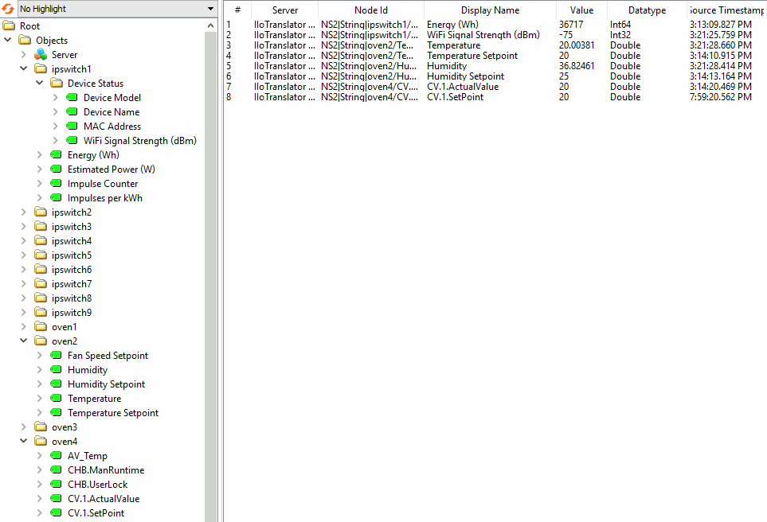

# IIoTranslator


IIoTranslator establishes connections with industrial equipment and makes their data available by hosting an OPC UA server. It achieves this by implementing a number of proprietary, device-specific protocols. Downtime is handled gracefully by automatically reconnecting as soon as a device comes back online.

## Available Device Drivers
- [WeissTechnik LabEvent](docs/drivers/WeissLabEvent.md): supports WeissTechnik LabEvent ovens.
- [Binder Ovens](docs/drivers/Binder.md)
  - Binder KB: older generation, has a rotating knob
  - Binder KBF: Newer generation, has a touch screen
- [IPswitch](docs/drivers/IPswitch.md) tested with IPswitch-S0m-Wifi
- [Keyence MK-U](docs/drivers/KeyenceMKU.md): supports Keyence MK-U6000/MK-U2000 series industrial ink-jet printers.
- Inficon ELT3000: coming soon

Note: a device driver being mentioned in this project does not imply any sort of support, warranty or endorsement by me, my current or any previous employer or the device manufacturer. Use at your own risk.

## Running the Application
### Quick Start with Docker (recommended)
1. Download the main branch and `cd` to it.
2. Build:
```
docker buildx build . -t iiotranslator:latest
```
3. Run (works on Linux & Windows PowerShell): 
```
docker run -p 4840:4840 -v ${PWD}:/config iiotranslator:latest
```
4. Use [UaExpert](https://www.unified-automation.com/products/development-tools/uaexpert.html) or any other OPC UA client to connect to the server at `opc.tcp://localhost:4840/`
5. Edit the application.properties file to change settings and add devices, then restart the application.

Note: it is important that a directory containing the `application.properties` file is mounted to `/config/` inside the container. This file contains the configuration for the application, including the devices to connect to. If it's missing or contains zero devices, the application won't start.

### Quick Start with Java
1. Install Java 17 (or newer) and Maven 3.
2. Download the main branch and `cd` to it.
3. Run the application:
```
mvn spring-boot:run
```
4. Use [UaExpert](https://www.unified-automation.com/products/development-tools/uaexpert.html) or any other OPC UA client to connect to the server at `opc.tcp://localhost:4840/`
5. Edit the application.properties file to change settings and add devices, then restart the application.

## Technology Stack
- Java 17
- Spring Boot 3.0
- Eclipse Milo OPC UA SDK
- Docker & BuildKit

## Development
1. Follow the above instructions to run the application with Java.
2. After making changes, run ``mvn spotless:apply`` to format your code before committing.